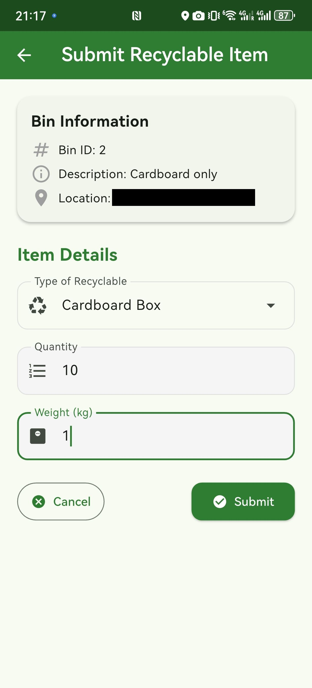
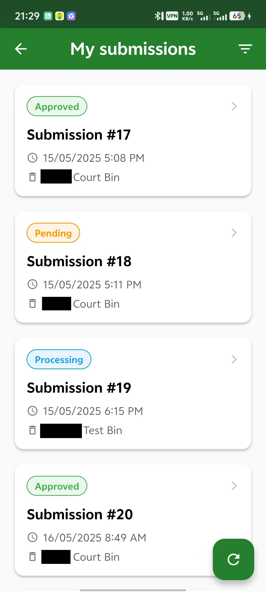

# Recycling Project Backend

### Overview

Python project that offered REST API for Flutter frontend and communicated with MariaDB database. Was hosted on Debian VPS provided by Nectar Cloud.

Libraries used:
- Flask (Web Framework)
- SQLAlchemy (ORM)
- pytest (Testing)
- marshmallow (Data validation)
- Pillow (Image processing)

---

### Frontend Screenshots

